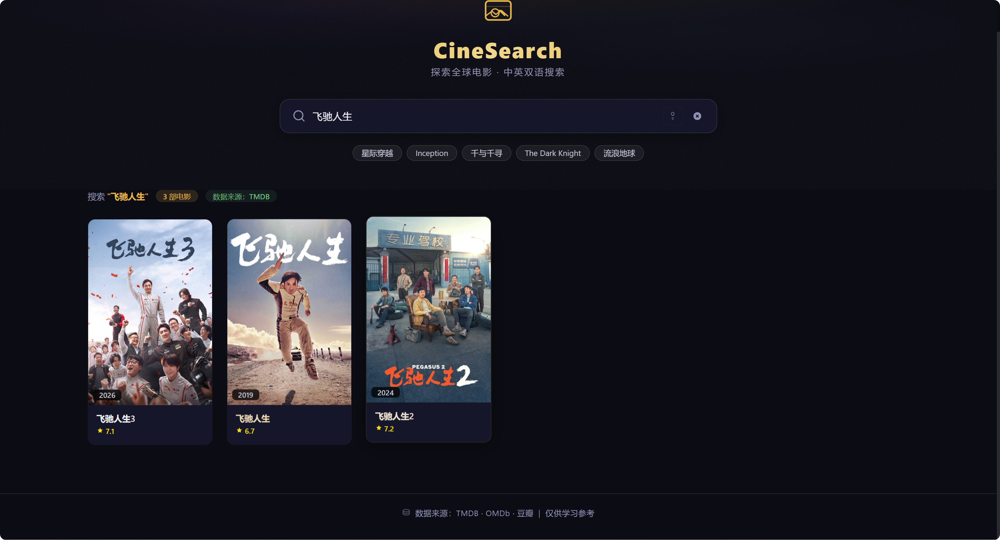

# Search Movie / 搜电影

**中英双语**全球电影检索工具，聚合 TMDB、OMDb、豆瓣三大数据源，无论输入中文还是英文，都能精准找到电影。

*A bilingual movie search engine supporting both Chinese and English queries, aggregating data from TMDB, OMDb, and Douban.*

## 特性

- 🔍 **中英文混合搜索** — 输入「Inception」或「盗梦空间」都能找到同一部电影，中文关键词自动翻译兜底
- 🤖 **AI 智能搜索** — 基于 DeepSeek 的自然语言理解，输入「一部关于篮球的电影」自动提取关键词搜索
- 📊 **电影排行榜** — 按类型、地区、评分/日期/票房排序，分页浏览，一键筛选
- 🎬 **正在热映** — 当前影院正在上映的电影，实时同步 TMDB 数据，自动过滤已下映影片
- 📅 **即将上映** — 近期即将上映的电影预告，只展示未上映的未来档期
- ⭐ **每日推荐** — 10 部影史经典每日轮换推送，附推荐理由和幕后冷知识
- 💡 **电影冷知识** — 30 条银幕背后的有趣故事，每天一条新发现
- 🎞️ 电影详情：海报、评分、演员阵容、预告片（YouTube 跳转）、剧照画廊、类似电影推荐、用户评论

## 截图

### 搜索列表



### 电影排行筛选


### 电影详情


### 类似电影推荐


## 快速开始

### 1. 获取 API Key

| 数据源 | 申请地址 | 费用 |
|--------|----------|------|
| TMDB | [themoviedb.org/settings/api](https://www.themoviedb.org/settings/api) | 免费 |
| OMDb | [omdbapi.com/apikey.aspx](https://www.omdbapi.com/apikey.aspx) | 免费 |
| DeepSeek | [platform.deepseek.com](https://platform.deepseek.com) | 按量付费（极低） |

> TMDB 国内可直接访问，建议优先配置。DeepSeek 为 AI 智能搜索所需，不配置不影响普通搜索。

### 2. 配置环境变量

复制 `server/.env.example` 为 `server/.env`，填入你的 API Key：

```env
TMDB_API_KEY=你的TMDB_API_KEY
OMDB_API_KEY=你的OMDB_API_KEY
DEEPSEEK_API_KEY=你的DeepSeek_API_KEY   # AI 搜索（可选）
PORT=3001
```

### 3. 安装依赖并启动

```bash
# 安装根目录依赖（concurrently）
npm install

# 安装前后端依赖
cd client && npm install && cd ..
cd server && npm install && cd ..

# 一键启动（前后端同时运行）
npm run dev
```

访问 **http://localhost:5173** 即可使用。

### 单独启动

```bash
# 后端（热重载）
npm run dev:server

# 前端（HMR）
npm run dev:client
```

## 页面导航

顶部导航栏提供 **6 个标签**，覆盖搜索和发现两种使用场景：

| 标签 | 路由 | 数据来源 | 说明 |
|------|------|----------|------|
| 首页 | `/` | TMDB / OMDb / 豆瓣 | 普通搜索 + AI 智能搜索 |
| 热映 | `/now-playing` | TMDB `/movie/now_playing` | 当前影院热映电影（自动过滤 6 个月前下映影片） |
| 即将上映 | `/upcoming` | TMDB `/movie/upcoming` | 近期未上映电影（自动排除已上映） |
| 每日推荐 | `/daily` | 静态数据 | 10 部影史经典每日轮换，点击切换 |
| 电影冷知识 | `/trivia` | 静态数据 | 30 条电影幕后趣闻 |
| 全部电影 | `/ranking` | TMDB `/discover/movie` | 按类型/地区/排序筛选探索 |

## 项目结构

```
mov/
├── client/                     # 前端 (Vue3 + Vite + TS + Vue Router)
│   ├── .env.production         # 生产环境变量
│   └── src/
│       ├── router/index.ts     # Vue Router（6 条懒加载路由）
│       ├── api/movie.ts        # Axios 请求封装
│       ├── data/
│       │   └── movieTrivia.ts  # 静态数据：30条冷知识 + 10部每日推荐
│       ├── components/
│       │   ├── SearchBar.vue   # 搜索栏（普通/AI 双模式）
│       │   ├── MovieList.vue   # 搜索结果网格
│       │   ├── MovieCard.vue   # 电影卡片（海报+名称+评分，首页/排行/热映/即将上映复用）
│       │   ├── MovieDetail.vue # 详情弹窗（评论 + 类似电影 + 预告片）
│       │   ├── DiscoverFilter.vue # 排行页筛选组件
│       │   └── AppFooter.vue   # 页脚
│       ├── views/
│       │   ├── HomePage.vue    # 首页（搜索入口）
│       │   ├── DiscoverPage.vue# 全部电影（筛选+分页）
│       │   ├── NowPlayingPage.vue # 正在热映（TMDB，分页+详情弹窗）
│       │   ├── UpcomingPage.vue   # 即将上映（TMDB，分页+详情弹窗）
│       │   ├── DailyPage.vue      # 每日推荐（静态数据，点击切换）
│       │   └── TriviaPage.vue     # 电影冷知识（静态数据，30条编号列表）
│       ├── types/movie.ts      # TypeScript 类型定义
│       ├── App.vue             # 布局壳（6标签导航栏 + router-view）
│       └── main.ts             # 入口
├── server/                     # 后端 (Express + TS)
│   ├── Dockerfile              # CloudRun 容器构建（Node 20-alpine）
│   ├── entrypoint.sh           # 容器启动脚本
│   ├── .dockerignore           # Docker 构建忽略规则
│   ├── cloudbaserc.json        # CloudRun 配置
│   └── src/
│       ├── routes/
│       │   ├── movie.ts        # 搜索/详情/AI搜索/图片代理路由
│       │   ├── discover.ts     # 电影筛选探索路由
│       │   ├── now-playing.ts  # 正在热映路由
│       │   └── upcoming.ts     # 即将上映路由
│       ├── services/
│       │   ├── tmdb.ts         # 数据源服务层（搜索/详情/discover/now_playing/upcoming）
│       │   └── deepseek.ts     # DeepSeek AI 服务（自然语言→关键词）
│       ├── types/movie.ts      # 类型定义（含 TMDBCollection/TMDBReleaseDate 等）
│       └── index.ts            # Express 入口（CORS + 端口 3000）
├── docs/
│   └── DEPLOY-20260605.md      # 部署文档（发版流程 + 踩坑记录）
├── screenshots/                # 项目截图
├── package.json                # 一键启动脚本
└── README.md
```

## API 接口

| 接口 | 说明 |
|------|------|
| `GET /api/search?keyword=xxx&page=1` | 普通搜索电影列表 |
| `GET /api/ai-search?keyword=xxx` | AI 智能搜索（DeepSeek 理解自然语言） |
| `GET /api/discover?genre=xx&region=xx&sortBy=xx&page=1` | 电影筛选探索（按类型/地区/排序分页） |
| `GET /api/movie/:id` | 获取电影详情（id 格式：`tmdb_xxx` / `ttxxx` / `douban_xxx`） |
| `GET /api/now-playing?page=1` | 正在热映（自动过滤 6 个月前上映的电影） |
| `GET /api/upcoming?page=1` | 即将上映（自动过滤已上映电影） |
| `GET /api/image-proxy?url=xxx` | 图片代理（解决豆瓣防盗链） |
| `GET /api/health` | 健康检查 |

## 正在热映 & 即将上映

基于 TMDB 免费 API，实时获取影院热映和即将上映的电影数据：

- **正在热映** (`/now-playing`)：拉取 TMDB `/movie/now_playing`，后端自动过滤 `release_date` 在最近 6 个月内的电影，排除已下映过期数据
- **即将上映** (`/upcoming`)：拉取 TMDB `/movie/upcoming`，后端自动过滤只保留 `release_date >= 今天` 的电影，确保数据准确性
- 两个页面均支持分页浏览（每页 20 条）和点击查看电影详情弹窗

## 每日推荐 & 电影冷知识

纯前端静态数据，无需后端 API，加载极快：

- **每日推荐** (`/daily`)：10 部影史经典（肖申克的救赎、千与千寻、星际穿越、霸王别姬等），根据一年中的第几天自动轮换推送今日推荐。点击下方列表可切换顶部卡片，选中的电影高亮显示
- **电影冷知识** (`/trivia`)：30 条银幕幕后趣闻（侏罗纪公园、阿甘正传、蝙蝠侠：黑暗骑士等），同样按日期轮换，每次访问看到不同的冷知识

## 电影排行 / Discover

点击顶部导航栏 **"全部电影"** 进入排行页，支持：

- **类型筛选** — 18 种电影类型标签（动作、喜剧、恐怖、科幻等），点击切换，选中金色高亮
- **地区筛选** — 12 个国家/地区（中国、美国、日本、韩国、印度、英国、法国、泰国、西班牙、香港、台湾），按制作国家（`with_origin_country`）精准筛选
- **排序** — 评分 / 上映日期 / 票房，点击切换升降序（↓↑ 箭头指示），点击即查
- **分页** — 每页 20 条，底部翻页组件

## 数据源策略

搜索和详情采用**三级数据源策略**，自动路由：

| 优先级 | 数据源 | ID 前缀 | 说明 |
|--------|--------|---------|------|
| 主 | **TMDB** | `tmdb_` | 数据最全，中英文均支持，国内可直连 |
| 兜底 | **OMDb** | `tt` | IMDb 数据库，数据丰富但中文差 |
| 兜底 | **豆瓣** | `douban_` | 中文电影补全 OMDb 不足，无预算/评论 |

**详情字段覆盖**：

| 字段 | TMDB | OMDb | 豆瓣 |
|------|:----:|:----:|:----:|
| 海报 | ✅（代理） | ✅（代理） | ✅（代理） |
| 演员（头像） | ✅ | ❌ | ❌ |
| 导演 / 编剧 | ✅ | ✅ | ✅ |
| 上映时间 / 时长 | ✅ | ✅ | ✅ |
| 剧情简介 | ✅ | ✅ | ✅ |
| 评分 | ✅（TMDB） | ✅（IMDb） | ✅（豆瓣） |
| 类型 / 分级 | ✅ | ✅ | ✅ |
| 语言 / 国家 | ✅ | ✅ | ✅ |
| 获奖情况 | ❌ | ✅ | ❌ |
| 票房 | ✅ | ✅ | ❌ |
| 预算 | ✅ | ❌ | ❌ |
| **用户评论** | ✅ | ❌ | ❌ |
| **类似电影** | ✅ | ❌ | ❌ |

## AI 智能搜索

点击搜索框右侧的 **"AI搜索"** 按钮切换到 AI 模式，输入自然语言描述（如「一部关于篮球的电影」「诺兰导演的烧脑电影」），按 Enter 即可。

### 工作原理

```
用户自然语言 → DeepSeek 理解意图 → 提取关键词 → TMDB 搜索电影 → 返回结果
```

例如输入「推荐一部适合情侣看的轻松喜剧」，DeepSeek 会分析并提取 `["comedy romance 2024", "轻松 喜剧 爱情"]` 等关键词，再用这些关键词搜索 TMDB。

### 与普通搜索的对比

| | 普通搜索 | AI 搜索 |
|---|----------|---------|
| 触发方式 | 输入自动搜索 | 点击 AI 按钮后按 Enter |
| 输入类型 | 电影名称 / 关键词 | 自然语言描述 |
| 搜索方式 | 直接搜索 TMDB | DeepSeek 理解 → TMDB |
| 适用场景 | 知道片名精准查找 | 模糊需求、按类型/情绪探索 |

> 仅供学习参考

---

## 部署

### 在线访问

| 服务 | 地址 |
|------|------|
| **前端（静态托管）** | [https://movie-search-d0g1nye13469cff80-1440395009.tcloudbaseapp.com](https://movie-search-d0g1nye13469cff80-1440395009.tcloudbaseapp.com) |
| **后端 API（CloudRun）** | `https://movie-api-266664-8-1440395009.sh.run.tcloudbase.com` |

### 架构

```
GitHub 仓库 (dev 分支)
├── 前端 (Vue3 + Vite) → npm run build → CloudBase 静态托管 → CDN 加速
└── 后端 (Express + TS) → Dockerfile 构建 → CloudRun 容器模式 → Serverless 运行
    └── 环境变量注入: NODE_ENV / PORT / TMDB_API_KEY / OMDB_API_KEY / DEEPSEEK_API_KEY
        ↑ Key 存储在腾讯云控制台，不进入代码仓库
```

### 部署步骤

#### 1. 前端部署（静态托管）

```bash
cd client
npm run build
# 将 dist/ 目录上传到 CloudBase 静态托管根路径
```

#### 2. 后端部署（CloudRun）

**方式一：本地代码部署（推荐，稳定）**

通过 CloudRun 工具从本地 `server/` 目录打包上传并部署。

**方式二：Git 模板部署（自动触发）**

绑定 GitHub 仓库后，push 代码自动构建部署。需在控制台配置：
- **构建命令**: `npm install && npm run build`
- **启动命令**: `node dist/index.js`
- **端口**: `3000`

### Docker 配置

| 文件 | 说明 |
|------|------|
| `Dockerfile` | Node 20-alpine 镜像 + HEALTHCHECK 健康检查 |
| `.dockerignore` | 排除 node_modules/.env/dist 等 |
| `entrypoint.sh` | 启动脚本（输出调试日志） |

**关键配置项**:
- `InitialDelaySeconds: 15` — 探针延迟 15 秒（Node 启动需要时间）
- `PORT=3000` — 显式设置端口
- `NODE_ENV=production` — 生产模式

### 部署平台

| 资源 | 平台 | 套餐 | 费用 |
|------|------|------|------|
| 云环境 | 腾讯云 CloudBase | 免费体验版 | 免费（8个月） |
| 后端服务 | CloudRun 容器模式 | 按量付费 | 有免费额度，Demo 够用 |
| 前端托管 | CloudBase 静态网站托管 | 含在 CloudBase 中 | 免费 |
| 数据库 | CloudBase 文档数据库 | 含在体验版中 | 免费 |

### ⚠️ 重要：配置 API Key

部署后需要在 **CloudRun 控制台** 配置环境变量，否则后端无法调用外部 API：

1. 进入 **CloudBase 控制台 → 云函数/托管理/主机 → 服务管理**
2. 点击 `movie-api` 服务
3. 找到 **「版本管理」→「环境变量」**
4. 添加以下 3 个变量：

| 变量名 | 值来源 | 说明 |
|--------|--------|------|
| `TMDB_API_KEY` | 你本地 `server/.env` 中的值 | TMDB 电影数据源 |
| `OMDB_API_KEY` | 你本地 `server/.env` 中的值 | OMDb IMDb 数据源 |
| `DEEPSEEK_API_KEY` | 你本地 `server/.env` 中的值 | AI 搜索（可选） |

5. 保存后重新部署或等待自动生效

### 本地开发

```bash
# 一键启动前后端
npm run dev
# 前端 http://localhost:5173 | 后端 http://localhost:3001
```
